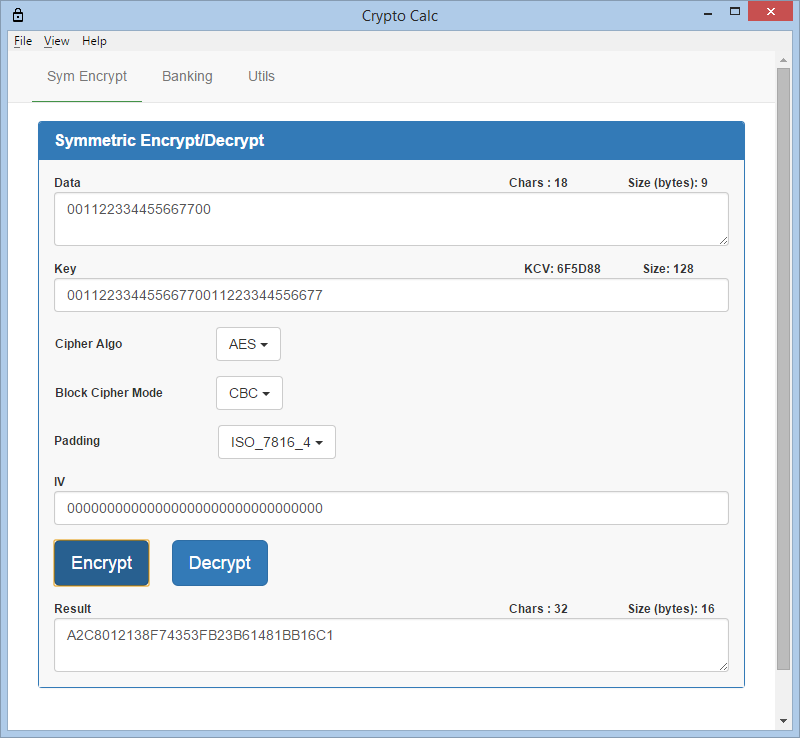
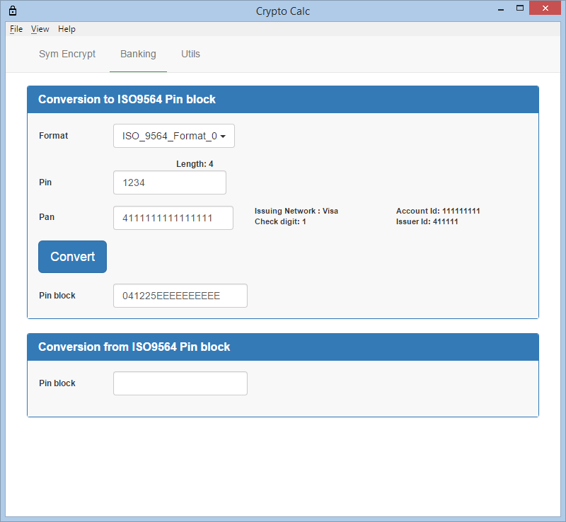
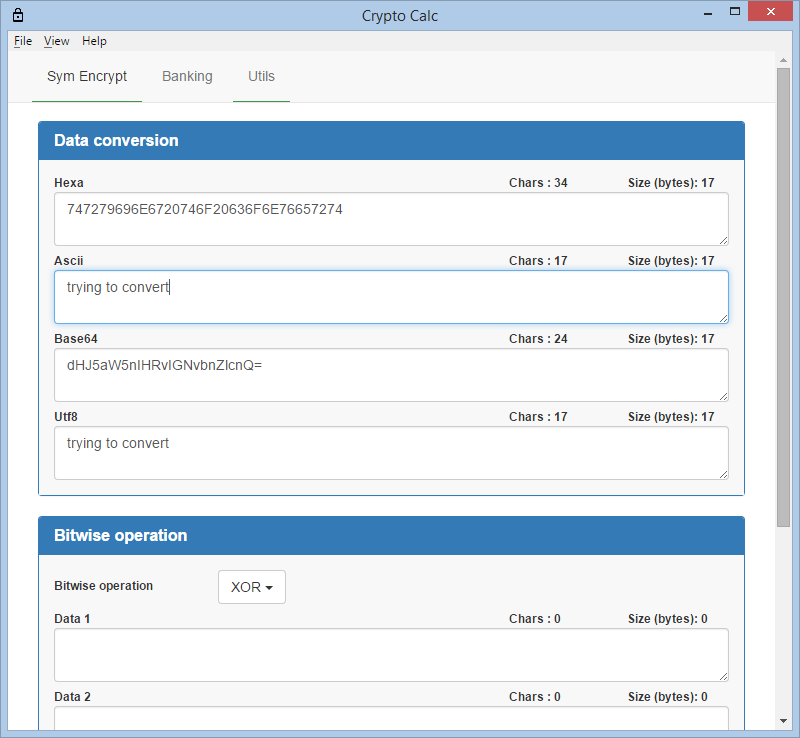

# crypto-calc

> Cryptographic Calculator

Crypto-calc is a crypto "swiss army knife" like app that enables to perform some cryptographic operations on small amount of data
It is developed in javascript and offers 2 flavours: 
* A desktop app based on [atom/electron](https://github.com/atom/electron). It should run on Windows,Mac,Linux but has only been tested on Windows
* A web app. It should run fine on Chrome/Firefox/Safari (the Internet Explorer has some issues even on IE 11 ). Note that all cryptographic
operations run locally (no Ajax)

It is still in development and should not be used for production.
To see a live demo go to [cryptocalc.dewavrin.info](http://cryptocalc.dewavrin.info). Again do not use for production especially since
it is delivered on http and content can be easily altered with mitm.

So far it supports :
* Symmetric encryption/decryption (AES,DES,3DES) with different padding PKCS5/7 and ISO-7816-4

  
	
* Banking :
  * ISO9564 Pin block generation and parsing
  * Primary Account Number parsing
  
  

* Utilities : Encoding/Decoding to/from base64,hexa string, ascii...<br/>



## Windows Build

* Download and [Microsoft Visual Studio Express 13](https://www.visualstudio.com/en-us/products/visual-studio-express-vs.aspx)
* Download and install [nodejs](https://nodejs.org/download/)

From the command line,

Install dependencies

```
$ npm install
```
and build

```
$ npm run-script buildelectron
```
### Run

```
$ npm start
```
or execute the binary in the dist folder


## Web Build
Install dependencies

```
$ npm install
```
and build

```
$ npm run-script buildweb
```
The zip file in the dist folder holds the web app.

## License
MIT © [lude](http://github.com/lucdew/crypto-calc)
